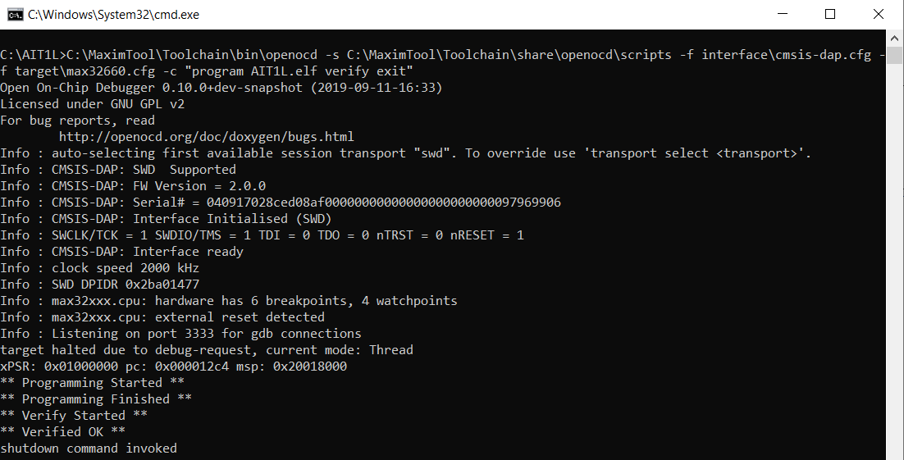

# SW Pakcgage

The firmware released is of the Beta phase, it includes the development of ADIN1100 and ADIN1200 drivers, 
enabling the MDIO interface through GPIO Bit Banging, also the UART debugging through the debug console for the MCU Info, ADIN1100 and ADIN1200 debug log. 

## Software Tools Used

**Software Used**: [ ECLIPSE MAXIMSDK ](https://www.maximintegrated.com/en/design/software-description.html/swpart=SFW0010820A) 
**Hardware Used**: Programming Cable (TC2030-IDC) and Programming Adapter – (MAX32625PICO#)

## Installation Notes

The installation manual followed for the development is as per the Programming Guide given for MAX32660 EVM Kit [(Programming_32660)](Programming_32660)  and following are the steps to be followed for debugging the device: 

1)	To open the given AIT1L project: page 14-19 in the above-mentioned document
2)	To build the project: Refer Page no. 6-7
3)	To debug the project: Refer Page no. 7-10
4)	To launch the UART debug console in serial terminal: 11-14

**Another way for flashing 10BASE-T1L without entering debugging mode:**

Tool used for flashing of device is Arm Toolchain and OpenOCD used to connect microcontrollers for debugging purpose. 

 To begin using OpenOCD, launch a command prompt window and change the directory to the location containing the application files you want to load. Load the file by running the following command line: 

[install_path]\Toolchain\bin\openocd -s [install_path]\Toolchain\share\openocd\scripts -f interface\[adapter].cfg -f target\[device].cfg -c "program [elf_file] verify exit"

Replace the parameters in [brackets] to match your configuration.
- [install_path]- This path where you installed the ARM toolchain. The default installation path is C:\Maxim
- [adapter] - The JTAG or SWD adapter connected to your board. In this case replace [adapter] --> cmsis-dap
- [device] - replace this with max32660
- [elf_file] - 10BASE-T1L-MC_B.elf

Command executed at development end:

C:\MaximTool\Toolchain\bin\openocd -s C:\MaximTool\Toolchain\share\openocd\scripts -f interface\cmsis-dap.cfg -f target\max32660.cfg -c "program AIT1L.elf verify exit" 

Note: Please follow the above replacements based on the installation path and project path at the individual end. 

Figure 8 shows an example for loading an AIT1L.elf to the device.

**Note**: Please follow the above replacements based on the installation path and project path at the individual end. 

Figure 8 shows an example for loading an AIT1L.elf to the device. 

Reference Web Link for Downloading the Software and all the steps for loading the program is shown below:

•	[How to Load Application to Maxim’s MAX32660 MCU](https://www.maximintegrated.com/en/design/technical-documents/app-notes/6/6973.html). 

